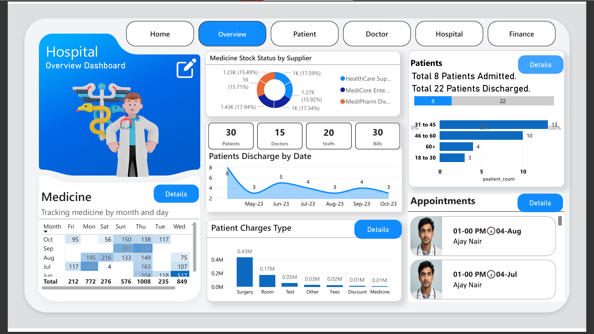
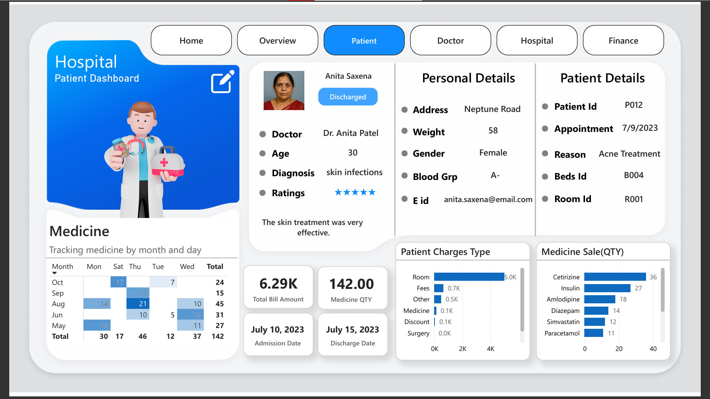
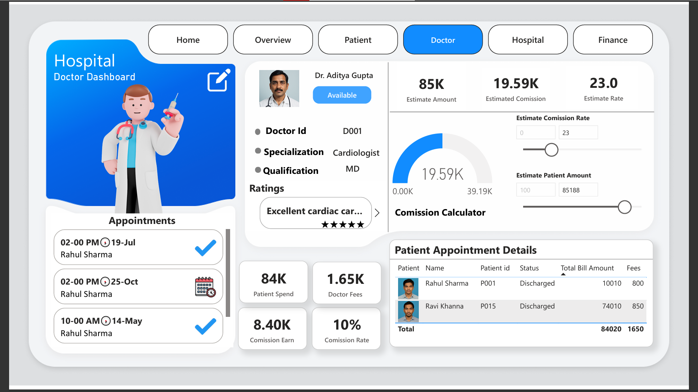
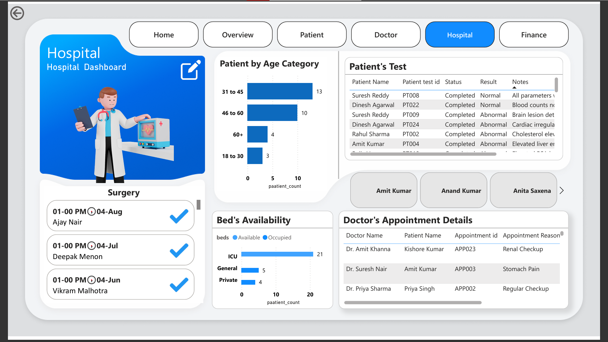
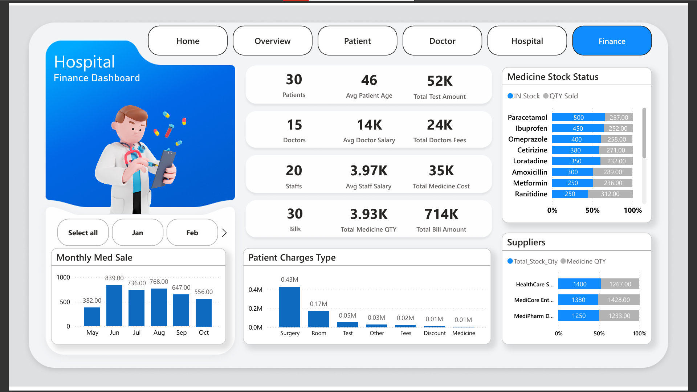
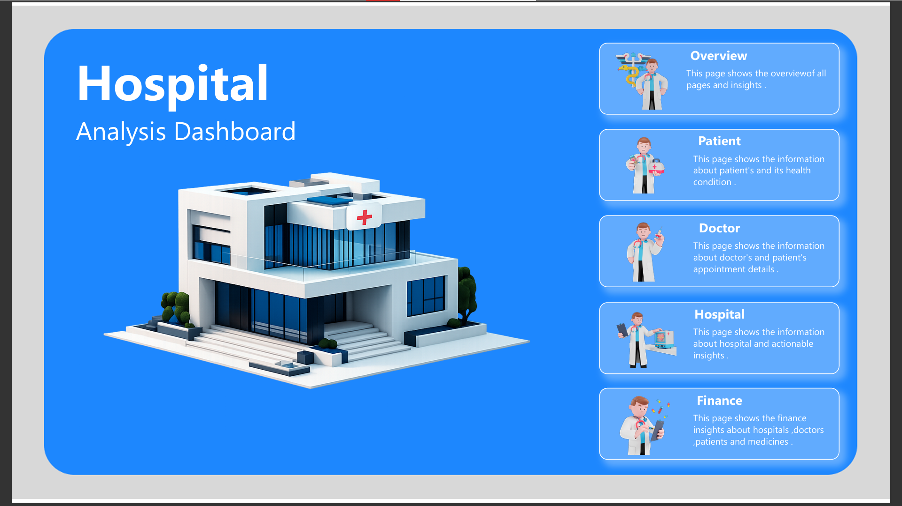

# 🏥 Hospital Power BI Dashboard: Healthcare Intelligence Simplified

An interactive Power BI dashboard designed to optimize hospital operations by visualizing critical data across patient management, doctor performance, hospital infrastructure, and finance. This project blends operational data with medical insights to enable data-driven decisions in healthcare environments.

---

## 📌 Purpose

The Hospital Dashboard provides a comprehensive view of daily hospital activities tracking patient details, doctor appointments, medication stock, finances, and performance KPIs. Designed for hospital administrators, doctors, and healthcare analysts to streamline operations and enhance care delivery.

---

## 🧰 Tech Stack

- **📊 Power BI Desktop** – Data visualization and dashboard design  
- **🧠 DAX (Data Analysis Expressions)** – Custom KPIs and dynamic calculations  
- **📂 Power Query** – Data preparation and transformation layer  
- **🧾 File Formats** – .pbix for development, .pdf for preview and sharing  

---

## 🔄 Data Cleaning & Transformation (ETL Process)

### 🧹 Data Cleaning:
- Removed null and duplicate records across patient and appointment data.
- Standardized column names and data formats.
- Addressed inconsistencies in date fields (admission/discharge).
- Normalized unit fields in finance and medicine data.

### 🔄 Data Transformation:
- Merged hospital departmental data using Power Query.
- Extracted date parts (month, day, year) for time-based filtering.
- Derived columns: Patient Age Group, Doctor Type, Medicine Category.
- Created lookup tables for Departments, Doctors, and Room Types.

### 🧠 Data Modeling:
- Linked datasets across Patient, Doctor, Finance, Appointments, and Medicines.
- Calculated KPIs using DAX, including:
  - Average Bill Amount per Patient
  - Monthly Medicine Trends
  - Bed Occupancy Rate
  - Doctor Commission Metrics

---

## 🗂 Data Source

Simulated hospital dataset including:
- Patient records (admission, discharge, feedback)
- Doctor information and commission logic
- Medicine stock and supplier data
- Financial billing and service charges
- Appointment records

---

## 🌟 Key Features

### 💼 Business Problem

Hospitals face fragmented data spread across departments, making it difficult to synthesize and analyze trends in operations, finances, and care delivery.

### 🎯 Goal of the Dashboard

- Unify operational, clinical, and financial data into a single analytical platform.
- Track hospital-wide KPIs across patients, medicines, and departments.
- Visualize appointment logs and staff performance.
- Enable dynamic filtering and actionable insights.

---

## 📊 Dashboard Pages & Visuals

### 🟡 1. Overview Page

- **Patient Charges Type (Bar Chart)**: Categorized cost breakdown across Surgery, Test, Room, Medicine, etc.  
- **Appointments Timeline (Table)**: Shows chronological doctor appointments and patient info.  
- **Summary KPIs**:  
  - Total Patients: 30  
  - Total Doctors: 15  
  - Staff Count: 20  
  - Total Bills: 30  
- **Patients Discharge by Date (Line Chart)**: Discharge trends across months.  
- **Patient Count by Age Group (Bar Chart)**: Distribution of patients by age segment.  
- **Medicine Stock Status by Supplier (Stacked Chart)**: Supplier-wise inventory comparison.

### 🟢 2. Patient Page

- **Patient Charges Type (Bar Chart)**: Charges per patient segmented by service.  
- **Medicine Sale by Month & Day (Matrix Table)**: Multilevel view of sales over time.  
- **Medicine Sale (Bar Chart)**: Most prescribed medicines visualized by quantity sold.  
- **Patient Profile Card**: Clinical and personal details (Diagnosis, Doctor, Room ID, Age, etc.)

### 🔵 3. Doctor Page

- **Doctor Profile Card**: Includes doctor’s ID, specialization, qualifications, and ratings.  
- **Commission KPIs**:  
  - Patient Spend: ₹84K  
  - Doctor Fees: ₹1.65K  
  - Commission Earned: ₹8.4K  
  - Commission Rate: 10%  
- **Appointments Table**: Upcoming appointments per doctor.  
- **Patient Appointment Summary**: Details like Status, Total Bill, and Fees.

### 🟣 4. Hospital Page

- **Doctor's Appointment Log (Table)**: Includes appointment reasons.  
- **Patients by Age (Bar Chart)**: Age distribution of hospital population.  
- **Test Result Table**: Test ID, status, result (Normal/Abnormal), and notes.  
- **Beds Availability (Bar Chart)**: Usage statistics across ICU, General, and Private beds.

  

### 🔴 5. Finance Page

- **Monthly Medicine Sales (Line Chart)**: Revenue from medicine sales over months.  
- **Patient Charges Breakdown (Bar Chart)**: Finance categorization across service types.  
- **Medicine Stock vs Sold (Bar Chart)**: Real-time stock vs consumed quantities.  
- **Supplier Stock Comparison (Bar Chart)**: Supply distribution by vendor.  
- **Financial KPIs**:  
  - Total Bill: ₹714K  
  - Medicine Cost: ₹35K  
  - Avg Patient Age: 46  
  - Avg Doctor Salary: ₹14K  
  - Avg Staff Salary: ₹3.97K

---

## 👥 Target Users

- **Hospital Administrators** – Operational performance monitoring  
- **Doctors & Clinicians** – Appointment and revenue tracking  
- **Finance Teams** – Revenue analysis and cost center optimization  
- **Inventory Managers** – Medicine stock and supplier analysis  

---

## 📸 Screenshots (To be uploaded)

| Page         | Screenshot Placeholder           |
|--------------|--------------------------------  |
| Home         |          |
| Overview     |  |
| Patient      |    |
| Doctor       |      |
| Hospital     |  |
| Finance      |    |

---
